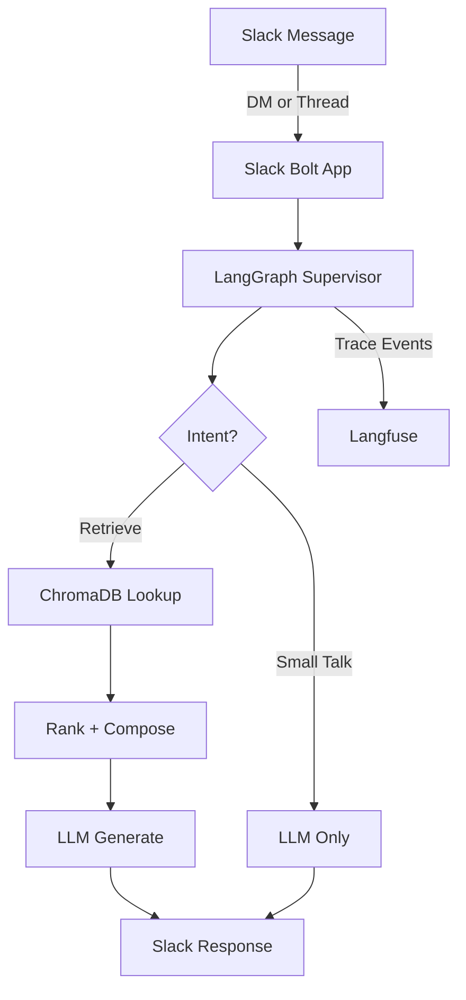

# 🧠 Ollama SlackBot — LangGraph-Based Chatbot for Slack

 an intelligent, traceable  assistant built with LangGraph, LangChain, ChromaDB, Ollama, and Langfuse. It integrates directly with Slack to answer  questions using a structured RAG (Retrieval-Augmented Generation) pipeline.

## 🔧 Tech Stack

- **Slack Bot (Bolt Socket Mode)** — Interacts with users in DM and threads
- **LangGraph** — Orchestrates the workflow using a stateful graph
- **LangChain** — Connects to Ollama LLM + Chroma vector store
- **Ollama** — Local or remote LLM + embedding model
- **ChromaDB** — Fast, lightweight vector database
- **Langfuse** — Observability with trace logging for each session

---

## 🚀 Quickstart

1. **Clone & Setup Environment**
   ```bash
   git clone <this-repo>
   cd supervisor_api
   cp .env.example .env
   ```

2. **Update `.env` with your credentials**
   - Slack tokens
   - Ollama / Chroma configuration
   - Langfuse API keys

3. **Run the stack**
   ```bash
   docker-compose up --build
   ```

4. **Test the API**
   ```bash
   curl -X POST http://localhost:8080/query \
     -H "Content-Type: application/json" \
     -d '{"query": "How do I update our time-off policy?"}'
   ```

---

## 🗺️ System Overview



---


## 🧠 Core Logic

- **`main.py`** — FastAPI entrypoint
- **`slack_integration.py`** — Slack event router
- **`langgraph_supervisor.py`** — LangGraph node pipeline:
  - `classify` → `retriever` → `grader` → `response`
- **`supervisor_agent.py`** — LangChain-based helpers (Ollama, Chroma)
- **`config.py`** — Environment-aware config for all services

---

## 🛠️ Dev Notes

- Chroma must be reachable via REST if running in Docker (`CHROMA_HOST`, `CHROMA_PORT`)
- Ollama must be reachable via REST if running in Docker (`OLLAMA_HOST`, `OLLAMA_PORT`)
- Langfuse requires valid public/secret keys and environment setup
- Responses are logged to Langfuse with full graph execution trace
- Slack integration supports DM and thread replies (notifies user in DM if public channel)

---

## ✅ To-Do

- [ ] Improve confidence-based grading logic
- [ ] Add document upload ingestion pipeline
- [ ] Integrate memory or Redis for long-term thread state

---

## 📄 License

MIT — free to use, modify, and contribute.

---

