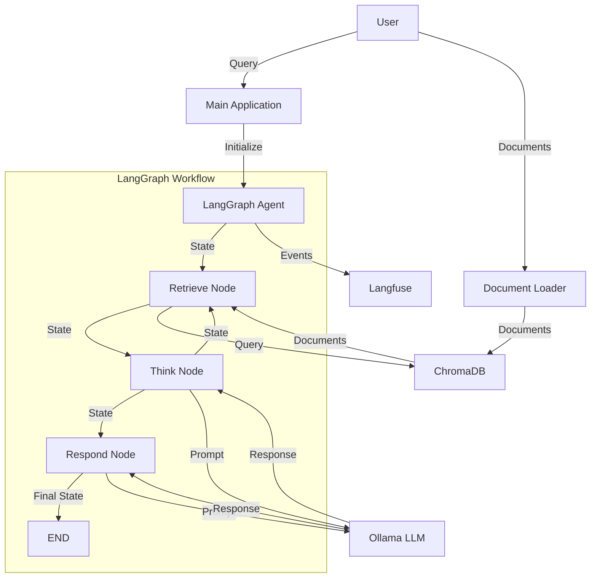

# LLM Agent Architecture

This document describes the architecture of the LLM Agent, which uses LangGraph for orchestration, Langfuse for observability, Ollama for local LLM inference, and ChromaDB for vector storage.

## Architecture Diagram

## Component Descriptions

### Main Application (`main.py`)
- Entry point for the application
- Handles user interaction
- Initializes the agent

### LangGraph Agent (`agent.py`)
- Implements the agent's workflow using LangGraph
- Manages state transitions between nodes
- Coordinates the retrieval, thinking, and response generation

### Document Loader (`document_loader.py`)
- Loads documents from files or directories
- Splits documents into chunks
- Stores document chunks in ChromaDB

### Configuration (`config.py`)
- Manages configuration for all components
- Loads settings from environment variables

## Workflow

1. **User Input**: The user provides a query to the agent.

2. **Retrieval**: The agent retrieves relevant documents from ChromaDB based on the query.

3. **Thinking**: The agent processes the retrieved information and decides on the next action.

4. **Response**: The agent generates a response to the user's query based on the retrieved information.

5. **Observability**: All events are logged to Langfuse for monitoring and analytics.

## Data Flow

1. Documents are loaded into ChromaDB using the document loader.
2. When a user submits a query, the agent retrieves relevant documents from ChromaDB.
3. The agent uses Ollama to process the retrieved information and generate a response.
4. The response is returned to the user.
5. All events are logged to Langfuse for monitoring and analytics.
